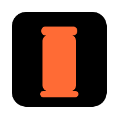

  <picture>
    <source media="(prefers-color-scheme: light)" srcset="./static/img/logo.png" />
    
  </picture>
  <a  href="https://binh.run/">
    <h2 align="center">Binh.run</h2>
  </a>
  <h3 align="center">Chạy bộ và sống khỏe mỗi ngày!</h3>

  

    
  

    <h4 align="center">Binh.run là nền tảng dành cho những người yêu thích chạy bộ và muốn sống một cuộc sống khỏe mạnh. Chúng tôi cung cấp các công cụ, mẹo và cộng đồng để giúp bạn đạt được mục tiêu chạy bộ của mình.</h4>

 

---

 

### Binh.run là gì?

**Theo dõi hành trình chạy bộ của bạn**

> Binh.run giúp bạn theo dõi các buổi chạy, đặt mục tiêu và cải thiện hiệu suất của mình. Với các công cụ theo dõi tiên tiến, bạn có thể xem tiến trình của mình và đạt được các mục tiêu chạy bộ.

**Cộng đồng người chạy bộ**

> Tham gia cộng đồng những người yêu thích chạy bộ. Chia sẻ kinh nghiệm, nhận lời khuyên và tìm động lực từ những người chạy khác trên hành trình của bạn.

**Sống khỏe mỗi ngày**

> Binh.run không chỉ là về chạy bộ. Chúng tôi khuyến khích một lối sống lành mạnh và cân bằng, giúp bạn sống tốt hơn mỗi ngày.

### [Bắt đầu hành trình chạy bộ của bạn ngay hôm nay!](https://binh.run)

---

Contributions are welcome! Read the [Contributing Guide](./CONTRIBUTING.md) for more information.
